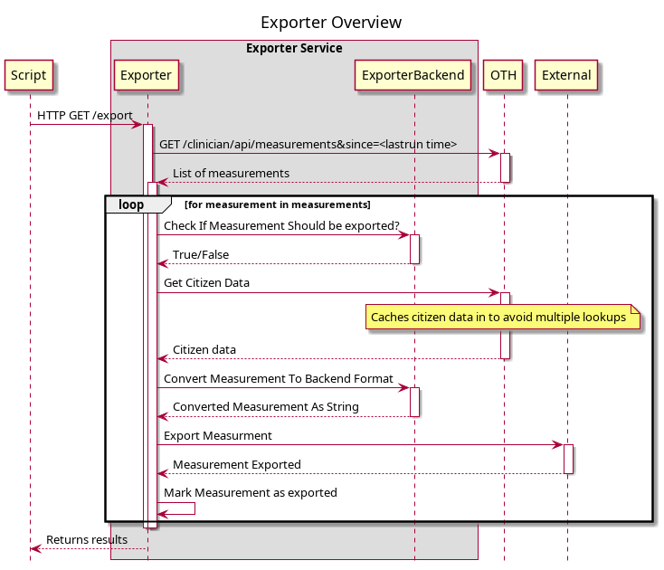
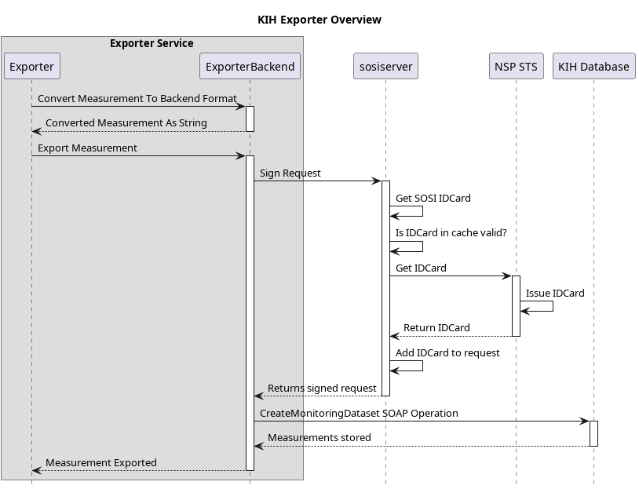
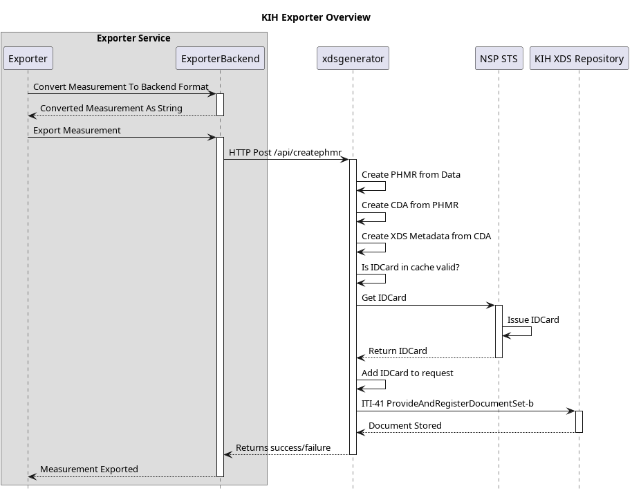

> This document is generated from `Documentation.org`.
> 
> Use the `documentation` Make target to generate it.

# Introduction

This document aims to provide the documentation for the OTH `exporter`.

# Exporter Functional Overview

The `exporter`&rsquo;s main responsibility is to export measurements stored in an OTH installation to an external system. The exporter has the following main responsibilities:

-   Keep a record denoting if an OTH measurement has been exported or not.
-   Support handling backend failures in a robust fashion
-   Map an OTH measurement from OTH API format to a specific backend format.

The current supported backends are:

-   KIH database
-   KIH XDS Repository

In order to provide an understanding of the functionality the sequence diagram below outlines how the exporter functions.

The `ConvertMeasurement` and `ExportMeasurement` can be as simple or complex as required. They can also invoke other service to help perform the task at hand. It all depends on the backend and it&rsquo;s requirements.

# Exporter HTTP endpoints

The exporter has the following endpoints:

    GET http://localhost:8360

    {
      "apiVersion": "1.1_build1",
      "environment": "dev",
      "links": {
        "measurement": "http://localhost:8360/measurement",
        "export": "http://localhost:8360/export",
        "failed": "http://localhost:8360/failed",
        "health": "http://localhost:8360/health",
        "status": "http://localhost:8360/status",
        "self": "http://localhost:8360/"
      }
    }

The following methods/endpoints are supported by the exporter.

## The /health endpoint

The `/health` endpoint is used to access basic health information about the service. It only supports `HTTP GET`

The output is as follows:

    GET http://localhost:8360/health

The health checks queries:

-   database
-   if kih export is selected:
    -   Sosiserver for idcard signing
    -   KIHDB for export

## The /export endpoint

The `/export` endpoint is used trigger the export. It only supports `HTTP GET`

When the export is started it does as follows:

1.  Find time of last run
2.  Get measurements from opentele from 30 minutes before time of lastrun
3.  For each measurement:
    1.  Check if measurement is already known and exported?
    2.  Convert measurements to output format
    3.  Export measurements
    4.  Mark measurement as exported
4.  Check if results was paginiation, if yes fetch next batch and perform steps in step 3
5.  Mark run as completed

The output is as follows:

    GET http://localhost:8360/export

    #+BEGIN_SRC js
    [
      {
        "Success": true,
        "Measurement": {
          "id": "d99394ab-2c51-440f-9aa1-4b97e62c8696",
          "measurement": "https://docker-demo.oth.io/clinician/api/patients/14/measurements/397",
          "patient": "https://docker-demo.oth.io/clinician/api/patients/14",
          "status": "COMPLETED",
          "created_at": "2020-02-25T15:58:40+01:00",
          "updated_at": "2020-02-25T15:58:41.361090851+01:00"
        }
      },
      {
        "Success": true,
        "Measurement": {
          "id": "883e39d0-ca2c-4995-9897-53c7b05528eb",
          "measurement": "https://docker-demo.oth.io/clinician/api/patients/13/measurements/396",
          "patient": "https://docker-demo.oth.io/clinician/api/patients/13",
          "status": "COMPLETED",
          "created_at": "2020-02-25T15:58:41+01:00",
          "updated_at": "2020-02-25T15:58:41.729067684+01:00"
        }
      },
    ]
    // GET http://localhost:8360/export
    // HTTP/1.1 200 OK
    // Content-Type: application/json; charset=utf-8
    #+END_SRC

## The /status endpoint

The `/statuss` endpoint is used to access basic metrics from the underlying service. It only supports `HTTP GET`

The output is as follows:

    GET http://localhost:8360/status

    {
      "Measurements": {
        "TotalMeasurements": 406,
        "TempFailedMeasurements": 0,
        "RejectedMeasurements": 5,
        "FailedMeasurements": 0
      },
      "LastRun": {
        "TimeStamp": "2021-06-23T17:23:32+02:00",
        "Status": "COMPLETED"
      },
      "Runs": {
        "Total": 5,
        "Failed": 0,
        "Successfull": 5
      },
      "Source": {
        "Endpoint": "https://docker-demo.oth.io/clinician/api"
      },
      "Destination": {
        "Type": "oioxds",
        "Endpoint": "http://localhost:9010/api/createphmr"
      }
    }

## The /failed endpoint

The `/failed` endpoint is used to trigger, failed measurements

## The /measurement endpoint

The =/measurement/ endpoint is used to retrieve a measurement using the ID for the measurement. The operations fetches both the exporters internal state, as well as the actual measurement and patient from OTH.

Example:

    GET localhost:8360/measurement/7ee1c80c-d687-4c02-9ac4-8a9bc8586111

    {
      "patient": {
        "createdDate": "2021-06-25T07:06:37.000Z",
        "uniqueId": "2512688916",
        "username": "Lisa",
        "firstName": "Lisa",
        "lastName": "Jensen",
        "dateOfBirth": null,
        "sex": "female",
        "status": "active",
        "address": "21 Carter Building Washington",
        "postalCode": "DC 20510",
        "city": "Washington DC",
        "place": null,
        "phone": null,
        "mobilePhone": "",
        "email": "",
        "comment": null,
        "patientGroups": [
          {
            "name": "Obstructive Lung Disease Clinic",
            "links": {
              "patientGroup": "https://docker-demo.oth.io/clinician/api/patientgroups/4"
            }
          }
        ],
        "relatives": [],
        "links": {
          "self": "https://docker-demo.oth.io/clinician/api/patients/14",
          "questionnaireSchedules": "https://docker-demo.oth.io/clinician/api/patients/14/questionnaire_schedules",
          "measurements": "https://docker-demo.oth.io/clinician/api/patients/14/measurement-types",
          "questionnaireResults": "https://docker-demo.oth.io/clinician/api/patients/14/questionnaire-results",
          "patientThresholds": ""
        }
      },
      "measurement": {
        "timestamp": "2021-06-02T09:00:00+02:00",
        "type": "bloodsugar",
        "measurement": {
          "unit": "mmol/L",
          "value": 6.900000095367432,
          "ignored": {
            "by": {
              "firstName": "",
              "lastName": "",
              "email": "",
              "links": {}
            }
          }
        },
        "origin": {
          "manualMeasurement": {
            "enteredBy": ""
          },
          "deviceMeasurement": {
            "connectionType": "bluetooth_spp",
            "manufacturer": "MyGlycoHealth",
            "model": "MyGlycoHealth",
            "primaryDeviceIdentifier": {
              "macAddress": "AA:BB:CC:DD:EE:FF"
            },
            "hardwareVersion": "A2",
            "firmwareVersion": "Z3",
            "softwareVersion": "B1",
            "additionalDeviceIdentifiers": [
              {
                "systemId": "123456",
                "other": {
                  "description": "",
                  "value": ""
                }
              },
              {
                "other": {
                  "description": "manufacturer_id",
                  "value": "ACF123G155"
                }
              }
            ]
          }
        },
        "links": {
          "patient": "https://docker-demo.oth.io/clinician/api/patients/14"
        }
      },
      "storedMeasurement": {
        "id": "7ee1c80c-d687-4c02-9ac4-8a9bc8586111",
        "measurement": "https://docker-demo.oth.io/clinician/api/patients/14/measurements/279",
        "patient": "https://docker-demo.oth.io/clinician/api/patients/14",
        "status": "COMPLETED",
        "created_at": "2021-05-21T13:58:15+02:00",
        "updated_at": "2021-05-21T13:58:16+02:00"
      }
    }

# Exporter Commands

The `exporter` binary has a the following sub commands:
The exporter has the following endpoints:

    exporter help

    OTH KIH export application
    
    Usage:
      exporter [flags]
      exporter [command]
    
    Available Commands:
      exportall   Starts export of all old measurements
      help        Help about any command
      migrate     Perform database migrations
      serve       Starts the KIH Export web server
      testinject  Reads measurements and patients from file and exports based on config
      version     Print the version number
    
    Flags:
          --exporter string   config file (default is exporter.yaml)
      -h, --help              help for exporter
    
    Use "exporter [command] --help" for more information about a command.

# Exporter Backends

There is currently implemented two backends

-   KIH Database exporter
-   OIOXDS exporter

## The KIH Database exporter

The `KIH Database` exporter uses the OIOXML for [&ldquo;Den Gode Kroniker Service&rdquo;](http://svn.medcom.dk/svn/releases/Standarder/Den%20gode%20kronikerservice/). The functionality is implemented in the `KihExporter` type. The main bulk of functionality for the `KihExporter` is located in the `kih` package.

The `KihExporter` requires the component [`sosiserver`](https://bitbucket.org/opentelehealth/sosiserver/src/master/) to handle [DGWS](http://svn.medcom.dk/svn/releases/Standarder/DGWS/) functionality to sign messages.

The flow for the `KihExporter` is depicted below:

## The KIH XDS Repository exporter

The `KIH XDS Repository` exporter uses the OIOXML for [&ldquo;Den Gode Kroniker Service&rdquo;](http://svn.medcom.dk/svn/releases/Standarder/Den%20gode%20kronikerservice/). The functionality is implemented in the `OioXdsExporter` type. The main bulk of functionality for the `OioXdsExporter` is located in the `kih` package.

The `OioXdsExporter` requires the component [`xds-generator`](https://bitbucket.org/opentelehealth/xds-generator/src/master/) to generate PHMR/CDA/XDS documents from measurement, sign with [DGWS](http://svn.medcom.dk/svn/releases/Standarder/DGWS/) if enabled, and submit to the `KIH XDS Repository`.

The flow for the `OioXdsExporter` is depicted below:

